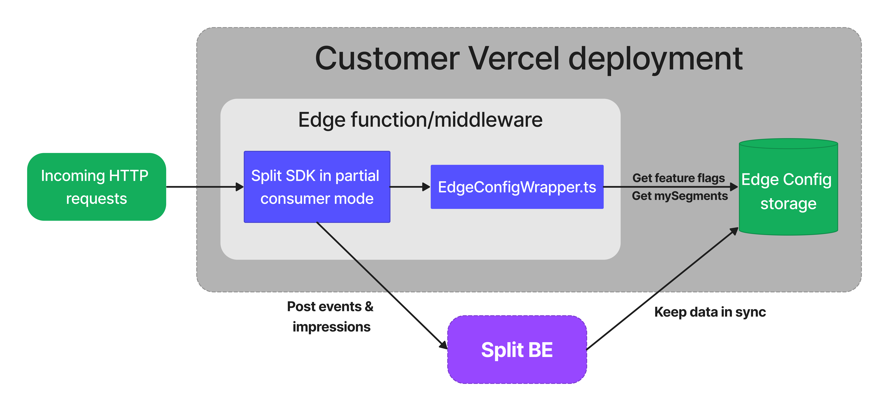

# Vercel integration using Edge Config and Split SDK

## Overview

This package provides a Split Storage Wrapper for Vercel Edge Config, a low latency data storage used to store and retrieve feature flag definitions for running the Split SDK on the Edge.

Keeping feature flag definitions within an Edge Config instance enables the Split SDK to operate in [partial consumer mode](https://help.split.io/hc/en-us/articles/360058730852-Browser-SDK#sharing-state-with-a-pluggable-storage). This mode means that the SDK doesn't fetch feature flags from the Split backend, and instead relies on those stored in the Edge Config, thereby significantly reducing the latency during feature flag evaluations.

The package includes the storage wrapper module (`src/EdgeConfigWrapper.ts`), as well as an `example` folder to quickly get started with the integration.

The project overall architecture is ilustrated in the following diagram:

<p align="center">
  
</p>

## Setup

1. Install the [Split integration](https://help.split.io/hc/en-us/articles/16469873148173) to start synchronizing feature flag definitions into your Edge Config instance.
2. Setup the Split SDK in your application project:
    - Install dependencies: `npm install @splitsoftware/splitio-browserjs @splitsoftware/vercel-integration-utils @vercel/edge-config`
    - Import and use the Split SDK with the EdgeConfig wrapper in your Edge function or middleware (check [API route example here](./example/pages/api/get-treatment.js)):
    ```javascript
    import { SplitFactory, PluggableStorage, ErrorLogger } from '@splitsoftware/splitio-browserjs';
    import { EdgeConfigWrapper } from '@splitsoftware/vercel-integration-utils';
    import * as EdgeConfigClient from '@vercel/edge-config';

    // Deploying as an Edge function here, but you can also use it on Edge middlewares and Serverless functions
    export const config = { runtime: "edge" };

    export default async function handler(req, event) {
      // Extract user key. In this case from a request query param
      const { searchParams } = new URL(req.url);
      const userKey = searchParams.get('userKey');

      const client = SplitFactory({
        core: {
          authorizationKey: '<YOUR_SPLIT_SDK_KEY>',
          key: userKey
        },
        mode: 'consumer_partial',
        storage: PluggableStorage({
          wrapper: EdgeConfigWrapper({
            // The Edge Config item where Split stores feature flag definitions, specified in the Split integration step
            edgeConfigKey: '<YOUR_EDGE_CONFIG_ITEM_KEY>',
            // The Edge Config client
            edgeConfig: EdgeConfigClient
          })
        }),
        // Disable or keep only ERROR log level in production, to minimize performance impact
        debug: ErrorLogger()
      }).client();

      // Wait to load feature flag definitions from the Edge Config
      await client.ready();

      const treatment = await client.getTreatment('SOME_FEATURE_FLAG');

      // Flush impressions asynchronously. Avoid 'await' on the destroy call, to not delay the response.
      event.waitUntil(client.destroy());

      return new Response(JSON.stringify({ treatment }), {
        status: 200,
        headers: { 'content-type': 'application/json' }
      });
    }
    ```
    - Remember to update the Split SDK key and Edge Config item key in the code above.
3. Deploy your application to Vercel and test the integration.

## Advanced use cases

### Provide an Edge Config connection string

By default, the Edge Config client access an Edge Config instance using the Connection String stored in the `EDGE_CONFIG` environment variable. That variable is automatically set by Vercel when you [connect the Edge Config to your project](https://vercel.com/docs/concepts/edge-network/edge-config/using-edge-config#using-a-connection-string) via the Vercel Dashboard.

However, you might require to use a different Edge Config instance, for example, if the default one is used for storing other data. In that case, you can create an Edge Config client with a different connection string, as shown below:

```javascript
import { createClient } from '@vercel/edge-config';

const client = SplitFactory({
  ...
  storage: PluggableStorage({
    wrapper: EdgeConfigWrapper({
      edgeConfigKey: '<YOUR_EDGE_CONFIG_ITEM_KEY>',
      edgeConfig: createClient('<YOUR-EDGE-CONFIG-CONNECTION-STRING>')
    })
  })
});
```
